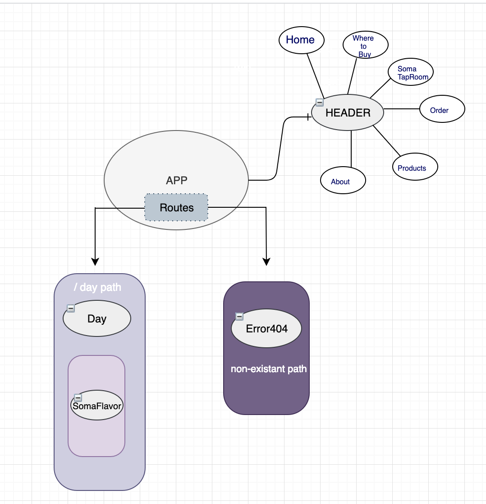

# _SOMA KOMBUCHA TAPROOM_

## _Epicodus Week 1-2 React!_

#### _Published April 19 ,2019_

#### Author: _**Doris Warren**_

## Description
_Soma Kombucha Taproom is considered one of the most healthiest drinks around! Would you like to order some booch? Objectives for this weeks Independent project, is to replicate a previous Angular project using REACT library._ 
* _I plan on making this website functional and interavtive._ 
* _UI\UX needs a make over, will add using CSS objects_
* _Stateful components and Menthod Binding will be troublesome. _

## Route Structure 

## Setup/Installation Requirements
* _Clone this repository grom Github_
* _Run `git clone` in your terminal of choice_
* _$ cd `soma-kombucha`_
* _Navigate to the folder inside your terminal and run `npm install`_
* _After the install is complete you can run `npm run start` to see a live version of the website._

## Development Notes 
* _When starting off, REACT has a more minimlist approach.Which is fine, you are able to add additional libraies based upon your needs. Angular provides a lot more features like `@angular/router` and `@angular/forms`._ 
* _Uses `JSX`, on top of JavaScript. Along with `State Managment` and `PropTypes`.(Still TRYING to understand this)._
* _Styling is a lot more complicated with React. This past week, I felt styling with REACT was a bit more complicated. I figured out an easier way to implement styling!

## Known Bugs

_There are no known bugs at this time.If you experience any, please give contact me._

## Support and contact details

_If you have any questions or conerns, please contact Doris Warren at doriswarren11@gmail.com_

## Technologies Used

_HTML_
_CSS_
_scss_
_JavaScript_
_JSX_Â
_Webpack_
_React_
_eslint_
_NPM_

### License

*This Software is Licensed under the MIT License.*

Copyright (c) 2019 **_Doris Warren_**
